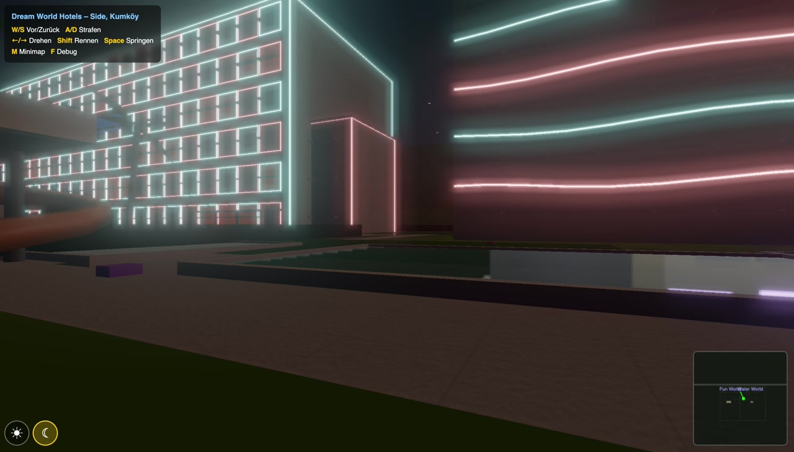
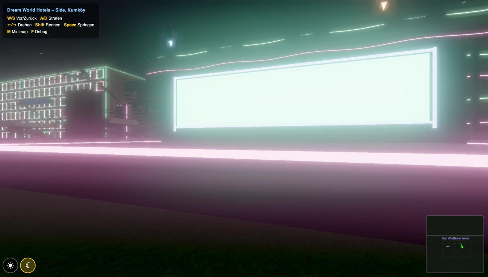
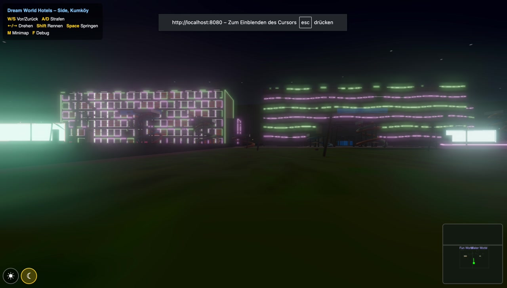
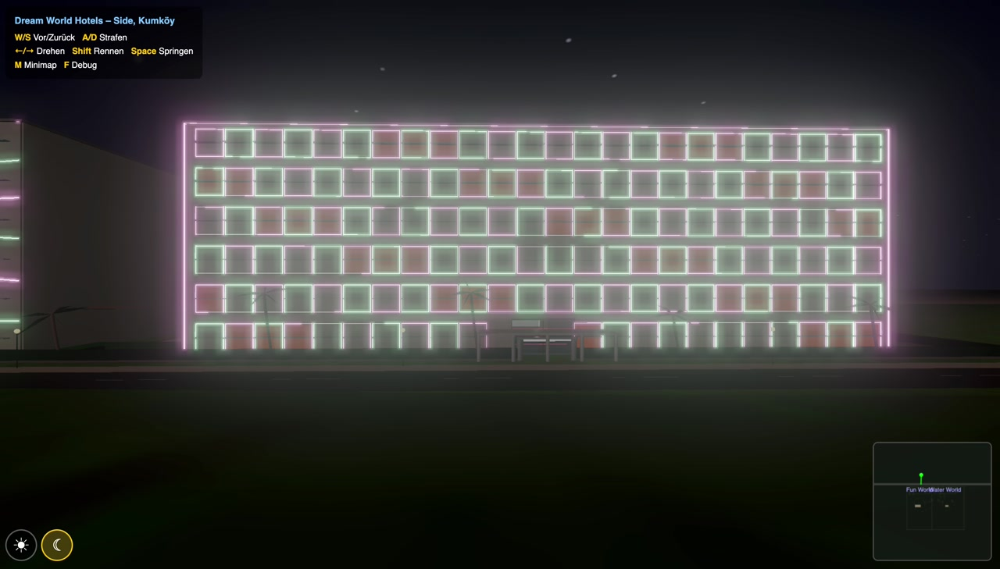
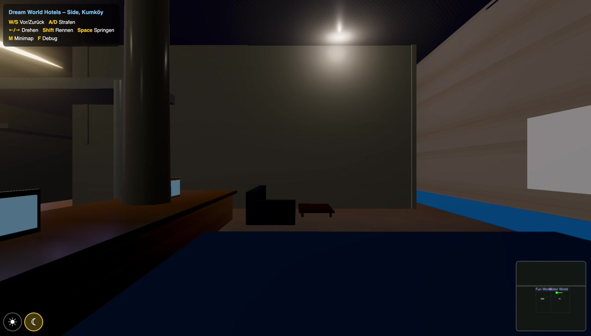
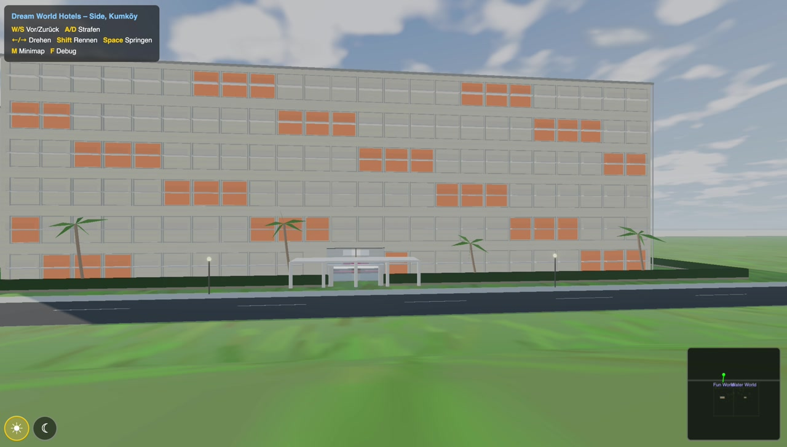
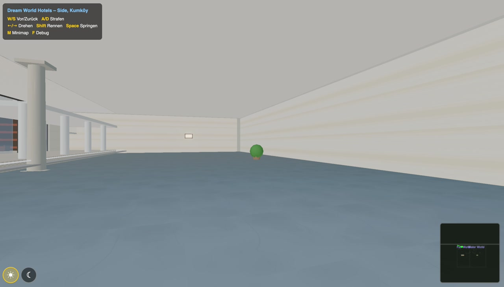
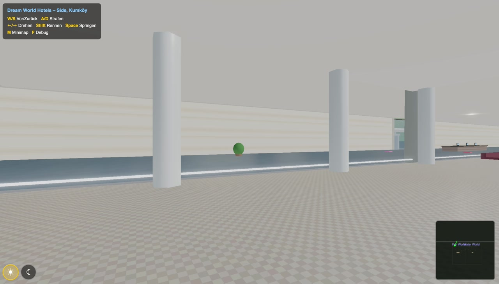
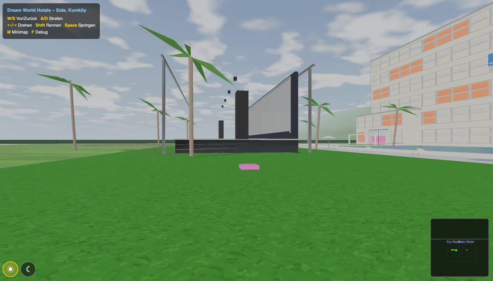
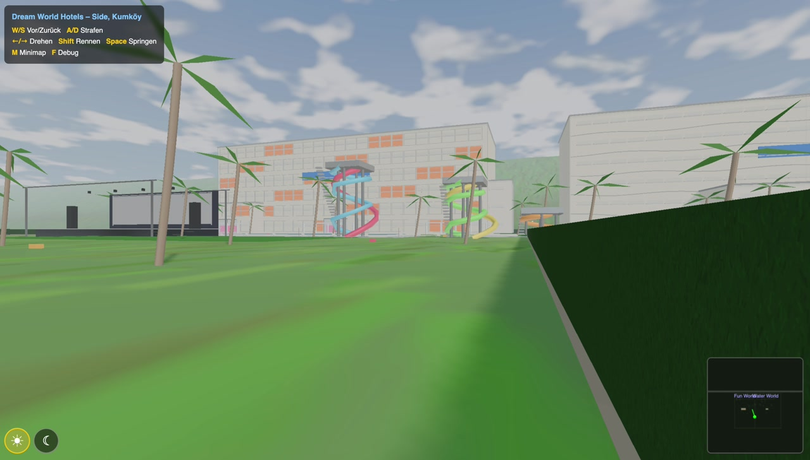

# Dream World Hotels – 3D WebGL First-Person Explorer

A real-time 3D reconstruction of the **Dream Fun World** and **Dream Water World** resort hotels in Side, Kumkoy (Antalya, Turkey) – explorable in first-person directly in the browser.

Built with [Three.js](https://threejs.org/) (ES modules, no bundler required).

### [Play it now in your browser!](https://pmmathias.github.io/hotelSim/)



---

## The Story Behind This Project

My son and I spent a wonderful holiday at the **Dream Fun World** resort in Side, Turkey. When it was time to go home, he didn't want the vacation to end. So I decided to build him a 3D walkthrough of the resort – **without writing a single line of code myself.**

**99% of this project was built in a single afternoon using [Claude Code](https://docs.anthropic.com/en/docs/claude-code)** – Anthropic's AI coding assistant. My role was purely that of a **product owner**: describing what I wanted, reviewing results, pointing out bugs, and giving feedback. Claude Code did everything else:

### What Claude Code did autonomously

| Role | What happened |
|------|--------------|
| **Researcher** | Searched the web and Google Maps for the real hotel layouts, building dimensions, room counts, pool positions, waterslide configurations, stage/amphitheater locations, LED lighting descriptions from guest reviews |
| **Architect** | Designed the 3D scene layout, chose Three.js as the rendering engine, planned the spatial partitioning (quadtree), collision system, and LOD strategy |
| **Texture Artist** | Wrote procedural texture generators (Canvas2D) for marble with veins, damask wallpaper with gold ornaments, wood grain with knots, sand, grass, concrete, water caustics – all from scratch, no external files |
| **3D Modeler** | Built all geometry programmatically: hotel buildings with balconies, glass doors, lobbies with furniture, 2nd floor rooms with beds and bathrooms, waterslide tubes, amphitheaters with truss rigs |
| **Shader Programmer** | Wrote custom GLSL shaders for the sky (sun, clouds, stars, moon), water reflections, and terrain height-blending |
| **Lighting Designer** | Implemented day/night cycle, LED animations (wave patterns, checkerboard, rainbow), disco lights, baked lightmaps, emissive ceiling panels |
| **Performance Engineer** | Profiled with Playwright, identified bottlenecks (GC pressure, terrain FBM, collision scan), built heightmap cache, spatial collision grid, pre-allocated vectors, LOD system |
| **QA Tester** | Wrote automated Playwright test suites: performance benchmarks, walkthrough tests, collision verification, geometry overlap detection, floor plan generation |
| **DevOps** | Set up the GitHub repo, wrote the README, captured screenshots, managed commits |

### How to replicate this yourself

The key insight: **you don't need to code to build software with Claude Code.** You need to:

1. **Describe what you want** – "Build a 3D hotel scene where I can walk around in first person"
2. **Point out problems** – "The sky is black" / "I fall through the floor" / "The LEDs don't blink"
3. **Give creative direction** – "Make the stage MEGA FETT with disco lights!" / "The night sky needs stars and a moon"
4. **Request quality checks** – "Use Playwright to find performance bottlenecks" / "Generate floor plans to find geometry overlaps"
5. **Iterate rapidly** – Each fix-feedback cycle took seconds to minutes, not hours

The entire conversation – from "build me a WebGL hotel" to "push to GitHub" – happened in one continuous Claude Code session. The project grew organically through natural language dialogue, with Claude Code taking on whatever role was needed at each moment.

**Read the full story at [ki-mathias.de](https://ki-mathias.de/).**

---

## Features

### Resort Grounds
- Two complete hotel compounds (Dream Fun World & Dream Water World) with perimeter fencing and entrance gates
- 6 swimming pools with reflective water surfaces
- 11 waterslides across 6 towers (climbable stairs!)
- Two amphitheaters with LED screens, truss rigs, disco lights, and animated spotlights
- Palm trees, hedges, flower beds, beach area with parasols and loungers
- Procedural Mediterranean terrain with hills (north of the road)
- Animated cloud sprites + procedural sky with sun, clouds

### Hotel Buildings
- Multi-story buildings with balconies, glass railings, and glass entrance doors
- **Enterable lobbies** with Carrara marble floors (procedural veined texture), damask wallpaper, reception desk, chandeliers, sofas, potted plants
- **Climbable staircases** to the 2nd floor with proper physics (step-by-step height detection)
- **Hotel rooms** on the 2nd floor with beds, nightstands, lamps, bathrooms (toilet, sink, mirror)
- Stairwell enclosures to prevent clipping
- Hotel-specific features:
  - **Dream Fun World**: Split-level lobby with library corner, LED bookshelf lighting, checkerboard balcony LED frames (orange/cyan), Qum Village annex
  - **Dream Water World**: Wave Bar with stools, wave-shaped LED strips (blue/pink), boutique annex

### Day/Night Cycle
- **Sun button**: Bright daylight, clouds, sun disc with glow, LEDs off (grey/inactive)
- **Moon button**: Near-black sky with twinkling stars and moon, dark fog, buildings barely visible – LED strips and stage disco lights come alive in full rainbow colors



### Lighting & Materials
- PBR materials throughout (MeshStandardMaterial + MeshPhysicalMaterial)
- Carrara marble with clearcoat reflections (procedural vein generation)
- Damask wallpaper with gold ornamental pattern
- Walnut and oak wood grain textures (procedural, with knots and wave distortion)
- Glass doors with transmission/refraction
- Environment map (PMREMGenerator) for reflections
- Baked lightmap on lobby floor with pillar shadow occlusion
- Emissive ceiling panels + wall sconces for interior ambiance
- AgX tone mapping + Bloom post-processing

### Performance
- **Quadtree** spatial partitioning for frustum culling
- **LOD system** for hotels (full detail near, simple box far)
- **Heightmap cache** (256x256 bilinear lookup instead of live FBM noise)
- **Spatial collision grid** (20m cells, O(1) lookup instead of linear scan)
- Pre-allocated vectors in animation loop (zero GC pressure)
- Material caching system (shared materials reduce draw calls)
- Fence segments follow terrain height automatically
- Playwright performance test suite included

## Controls

| Key | Action |
|-----|--------|
| **W / S** | Walk forward / backward |
| **A / D** | Strafe left / right |
| **Arrow Left / Right** | Rotate |
| **Shift** | Run |
| **Space** | Jump |
| **M** | Toggle minimap |
| **F** | Toggle debug overlay (FPS, draw calls, triangles) |

Click the canvas to engage pointer lock. Use the sun/moon buttons (bottom-left) to toggle day/night.

## Quick Start

```bash
# No build step needed – just a local HTTP server
python3 -m http.server 8080
# Open http://localhost:8080
```

Or with Node:
```bash
npx serve .
```

## Tech Stack

- **Three.js r164** (ES modules via CDN importmap)
- **Procedural textures** (Canvas2D): sand, grass, concrete, wall plaster, water caustics, bark, marble, damask, wood grain, lobby tiles
- **Custom sky shader** (GLSL): gradient + sun disc + FBM cloud noise + star field + moon
- **Water addon** (Three.js Water.js): planar reflections for pools
- **Post-processing**: EffectComposer + UnrealBloomPass + OutputPass
- **Playwright**: automated performance testing and screenshot capture

## Project Structure

```
hotelSim/
  index.html          – HTML shell with UI (HUD, minimap, day/night buttons)
  main.js             – Scene construction, physics, animation loop (~2800 lines)
  textures.js          – Procedural texture generators (~1400 lines)
  bench.mjs           – Playwright performance benchmark
  perf-walk.mjs       – Comprehensive walkthrough performance test
  profile.mjs         – Frame-time profiler
  walkthrough.mjs     – Automated scene walkthrough test
  floorplan.mjs       – Orthogonal floor plan generator
  consistency-check.mjs – Geometry overlap detector
  tickets/            – Development tickets (all DONE)
  screenshots/        – Scene screenshots
```

## Screenshots

### Night Mode
| | |
|---|---|
|  |  |
|  |  |

### Day Mode
| | |
|---|---|
|  |  |
|  |  |
|  | |

## Performance

Tested via Playwright automated walkthrough (20 sections, ~1800 frames):

| Area | Avg Frame Time | P95 | Jank (>40ms) |
|------|---------------|-----|-------------|
| Lobby walk | 33.3ms | 33.7ms | 0% |
| Lobby rotate | 33.4ms | 34.0ms | 0% |
| Stair climbing | 33.3ms | 34.0ms | 0% |
| Pool area | 34.3ms | 34.3ms | 2% |
| Beach | 33.5ms | 34.1ms | 0% |
| Night mode | 33.5ms | 34.1ms | 1% |
| Long sweep | 33.6ms | 34.3ms | 0% |
| **Overall** | **35.1ms** | **34.3ms** | **2.8%** |

## Credits

- Hotel research based on [Dream Fun World](https://dreamfunworld.com.tr/en/) and [Dream Water World](https://dreamwaterworld.com.tr/en/) in Side, Kumkoy, Turkey
- Terrain generation inspired by [VogelSimulator](https://github.com/pmmathias/VogelSimulator)
- All textures procedurally generated (CC0-compatible, no external dependencies)
- **100% coded by [Claude Code](https://docs.anthropic.com/en/docs/claude-code)** (Claude Opus 4.6, 1M context) – not a single line was written by a human
- Human contribution: product vision, creative direction, bug reports, and the vacation memories that inspired it all

## Blog

Read more about the development of this project at [ki-mathias.de](https://ki-mathias.de/).

## License

MIT
